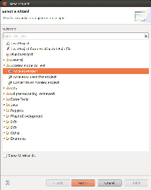
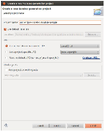
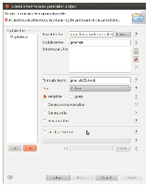
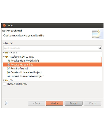
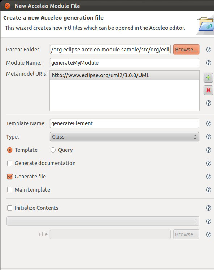

.. RobotML_Generators :

======================
The RobotML generators
======================

This generators allowed to generate source code from the :term:`RobotML<robotml>` model to some middleware or simulator.
They are include in the :term:`RobotML<robotml>` platform, and using :term:`Acceleo<acceleo>` to browse the :term:`RobotML<robotml>` model.

List of the RobotML platform generators:

* AROCCAM
* CycabTk
* MORSE
* ORROCOS
* RTMaps
* VLE

How to create a new RobotML generator
#####################################

In your **Project explorer** view, do right clic and select **New/Project..**. In the **New project** window, choose **Acceleo prject** in the **Acceleo model to text** category, and clic on **Next**.

   
In the window **Create a new Acceleo generator project**, name your project, and select the 1.5 JAVA version (J2SE-1.5). Clic on **Next**.

   
Now named your new module, and on the **add** button in the metamodel section. A metamodel list is shown. Select your metamodel should to use, and clic on OK.
For example if you should use UML, select **http://www.eclipse.org/uml2/3.0.0/UML** in the **developpement time version** tab.

.. note:: If you should use a custom domain specific language, select your metamodel in the **Runtime version** tab.

Select your module type: 

* **Template**, if you should to realize some generation with the metamodel.
* **Query**, if you should to do a functions library.

Clic on **Finish**

   
Your new RobotMLGenerators will added in your **Project explorer**. Now

Adding a new module to an existing RobotML generator
####################################################

On your **Acceleo generator project**, do right clic, and select **new/Other...**. Chosse **Acceleo module file** in the category **Acceleo model to text**, and clic **Next**.

Name your module, select the metamodel should to use, and select the module type. Clic on **Finsih**.

.. seealso:: How to create a new RobotML generator

Create a user interface for a RobotMl generator
###############################################

In your **Acceleo generator project**,, do right clic, and select **Acceleo/Create Acceleo UI launcher**. Name you UI project, clic on **Next**.
Select the project who will be called by your interface.

   
Give a label to your generator.

.. warning:: This label will be visible in the environment context menu.

Choose your working file filter. Your generator interface will be visible only if the selection match this file filter. Clic on **Finish**.

   
Implement a RobotML generator in your user interface
####################################################

In your Acceleo User interface project, open the file `GenerateAll.java`, and modifiy the method doGenerate() as following:

.. code-block:: java

   public void doGenerate(IProgressMonitor monitor) throws IOException {
      if (!targetFolder.getLocation().toFile().exists()) {
         targetFolder.getLocation().toFile().mkdirs();
      }
      
      monitor.subTask("Loading...");
      
      //GenerateXXX is the main class of the RobotML generator. By convention, <XXX> is the name of the generator.
      //Example for `Athena` langauge, the name of the main class is GenerateAthena.
      GenerateXXX generator = new GenerateXXX(modelURI, targetFolder.getLocation().toFile(), arguments);
      monitor.worked(1);
      String generationID = 
         org.eclipse.acceleo.engine.utils.AcceleoLaunchingUtil.computeUIProjectID("org.eclipse.robotml.generators.acceleo.XXX", 
         "org.eclipse.robotml.generators.acceleo.athena.files.GenerateXXX", 
         modelURI.toString(), 
         targetFolder.getFullPath().toString(), 
         new ArrayList<String>());
      generator.setGenerationID(generationID);
      generator.doGenerate(BasicMonitor.toMonitor(monitor));
   }

Validate a new RobotML generator
################################

In your **project explorer** view, select your :term:`RobotML<robotml>` generator, and do right clic. Choose, **Run as.../Eclipse application**. A new eclipse applciation start.
In this new envioronment, import the needed files to execute your generator, then select a imported file, do right clic. The contextual menu, should contain your gnerator label. Select it to execute your generator.

Exception
#########

In exception, if you using particular metamodel, it's necessary to register it befor using.
For example : if you use the :term:`DSL<dsl>` Athena, you should to initialized it with the following methods in your user interface code.

.. code-block:: java

   AthenaDSLFactoryImpl.init();
   AthenaDSLPackageImpl.init();

You need also to modifiy the :term:`RobotML<robotml>` generator code registerPackage method as following:

.. code-block:: java

   public void registerPackages(ResourceSet resourceSet) { 
      super.registerPackages(resourceSet);
      if(!isInWorkspace(org.xtext.athenaDSL.AthenaDSLPackage.class)) {
      resourceSet.getPackageRegistry().put(org.xtext.athenaDSL.AthenaDSLPackage.eINSTANCE.getNsURI(),
      org.xtext.athenaDSL.AthenaDSLPackage.eINSTANCE);
      }
   }
   
.. warning:: Do not forget replace the tag @generated by @generated not to not loosing your modification, when you modifiy the template file module.

 