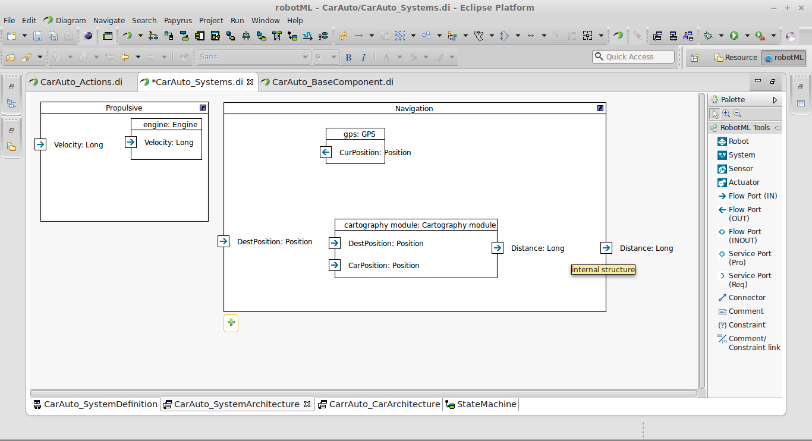
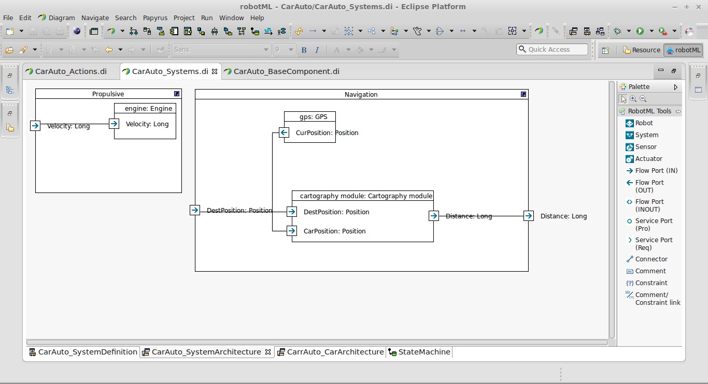
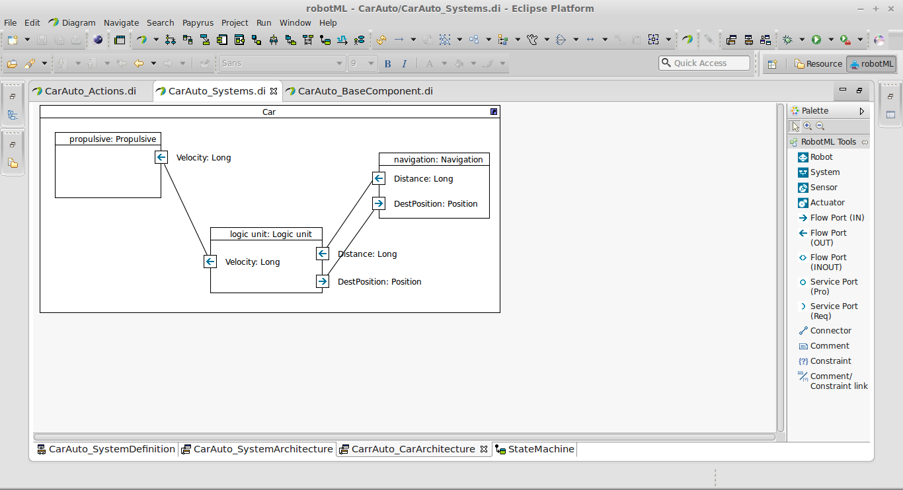

Propose a solution
""""""""""""""""""

Now we have proposing our scenary, we go resolve it. After had install the :term:`RobotML` platform, launch itand create a new workspace.
Two way exist to modelize the solution:

* First, create a :term:`RobotML` project including all necessary modelization's components.But component can not be reused for anothers model, it's boring. 
* Second, create some :term:`RobotML` project, someone contain all component of a defined perimeter. This solution permit modelization's capitalization with with importing *Components* project in the *hosting* project.

In our tutorial, we going to use the second method. We will go to define 4 project:

* The datatypes,
* The base components,
* The systems,
* The environment.

The Datatypes
*************

After a quick reflection, we can define the information that our car need:

* Time,
* Speed,
* Position,
* Destination,
* Commands (run, break, reverse, turn leftt, turn right).

*Time* will be define by *Long* datatype, *Speed* with the datatype *Real*, *Position* and *Destination* with the datatype *Position*. The *Commands* will be define by an enumeration.
First create a new :term:`RobotML` project. So in the *Project explorer* view, do a right clic with the mouse and select **New ...**. Select **RobotML project** in the dialog, and named the project as *CarAuto_Types*. Show the :term:`RobotML` perspective.

Now we go to create a new datatype. In the *Model explorer* select the main package, and do right clic with the mouse. Select **Add diagram...**, and create a new *Datatype diagram*. Select the *Datatype component* from the *Component menu* on the right of the screen, and drag it on the created diagram. Name it *Real*.

Repeat the operation to create the types *Long* and *Position*.

We go to define an enumeration to declare our car's commands. In the *component menu* select the enumeration component, and drag it on the datatypes diagram. Named this enumeration as *Commands*. Now we go to add the enumeration's values. Select the enumération, and in the *Owned literal* section from the *Property* view, clic on the *Add* button. A dialog to create an enumerate is showing. Named this enumerate as *Run* and put his type as *Long*. Repeat the operation for another enumerate (break, reverse, turn left, turn right).

Well our datatypes project is done. Now go to define the base components.

The base components
*******************
For a car be autonomous, we can imagine it need a propulsive system, naviagtion system, and a mind.
This section objective, is to define the components to build the different car's system. We going to declare:

* 4 engine (more simple in our example),
* 1 GPS,
* 1 cartography module,

First create a new :term:`RobotML` project as name *CarAuto_components*. Then create a new *Component definition diagram* in this project.
In the *Component menu* select the *Component* tool and drag it on the diagram to create a new component. Name it as "Engine". Repeat the operation for the others components (*GPS*, and *Cartography module*).    
 

 
We have defined our base components to build our car's system. Let go to build it!

The systems
***********

 Our car is composed by 3 systems : 
 
 * Navigation
 * Propulsive
 * Logic unity
 * Car
 
Create a new :term:`RobotML` project as name *CarAuto_Systems*. Next create a new *Component definition diagram*, create 3 new components (*Navigation*, *Propulsive*, and *Logic unity*).

Ok, now we go to define the systems content. To do it, we should import the :term:`RobotML` model where is define the using base component. In the *Project explorer*, select the *RobotMLModel* root, and select the function *Import/Import package from model* from the context menu. Choose the model *CarAuto_Component*, 

   
and import the *RobotMLModel* node.

Next create a new  *Architecture diagram* named as *CarAuto_SystemArchitecture*. In the *Model explorer* select the components *GPS*, and drag it in the *Navigation* system. Repeat the operation with the component *Cartography module*. In th *Model explorer*, select the component *Engine*, and drag it in the system *propulsive*. 

   
.. note:: This figure present an another component's presentation. Select a component and press Ctrl + F5 to modify his presentation.

Create another *Architecture diagram*, named as *CarAuto_CarArchitecture*. Drag the *Car* component on the diagram, and drag on it the following system :
 
 * Naviagtion
 * Propulsive
 * Logic unity
 

 
All right! Now we have building our car!
 
The environment
***************

Last step, we should to declare an environment. Our car need an environment to evolve.

Create a new :term:`RobotML` project as name *CarAuto_Environment*. Next create a new *Component definition diagram*. Select the *Environment* component from the *Right menu* and it on the diagram. Name this compoent as *Environment*.

   
Create a new *Architecture diagram* in the project and  import the *CarAuto_Systems* model. Next drag the *Environment* compoent on the diagram adn drag the *Car* component int the *Environment* component.

Ok we have create our problem solution, but it is not functionnal!!! Systems should communicate to work!!!

The component's communication
*****************************

Component communicate between us by *dataflow port*. We should define the informations exchanged between components. 

The base component communication
################################

Open the *CarAuto_Components* project and open the *Component definition diagram*. Now drag the *Engine component* on the diagram, select the dataflow tool from the Right menu. Clic on the *Car component* to add a dataflow port. Named the port as *velocity*. Select the created port and go to the profil tab of the properties.
Expand the current profil, and put the direction as *in* and the type as *Long*. The following array describe the component's port to add:

+--------------------+--------------+----------------+-----------+
| Component          | Port name    | Port direction | Port type |
+====================+==============+================+===========+
| Engine             | Velocity     | in             | Long      |
+--------------------+--------------+----------------+-----------+
| GPS                | CurPosition  | out            | Position  |
+--------------------+--------------+----------------+-----------+
| Cartography module | DestPosition | out            | Position  |
+--------------------+--------------+----------------+-----------+

Create the dataflow port for all component.
 

The system component communication
##################################

Open the *CarAuto_Systems* project and open the *Component definition diagram*. As done for the *base components*, add the following dataflow port to the following components.

+------------+--------------+----------------+-----------+
| Component  | Port name    | Port direction | Port type |
+============+==============+================+===========+
| Navigation | CarPosition  | out            | Position  |
+------------+--------------+----------------+-----------+
| Navigation | DestPosition | out            | Position  |
+------------+--------------+----------------+-----------+
| Propulsive | Velocity     | in             | Long      |
+------------+--------------+----------------+-----------+
| Logic unit | Velocity     | out            | Long      |
+------------+--------------+----------------+-----------+
| Logic unit | CarPosition  | in             | Position  |
+------------+--------------+----------------+-----------+
| Logic unit | DestPosition | in             | Position  |
+------------+--------------+----------------+-----------+
 

Now we should link the component's communication port. Open the *CarAuto_SystemArchitecture* diagram and select the connector tool from the right tools menu. Connect the differents system in this order:

- *Navigation/CarPosition* port to *Naviagtion/GPS/CurPosition* port,
- *Navigation/DestPosition* port to *Navigation/Cartography module/DestPosition* port,
- *Propulsive/Velocity* port to *Propulisve/Engine/Velocity* port.

Do the operation on the car's system. Open the *CarAuto_CarArchiecture* diagram, and connect the following systems between us:

- *Navigation/CarPosition* port to *Logic unit/CarPosition* port,
- *Navigation/DestPosition* port to *Logic unit/DestPosition* port,
- *Logic unit/Velocity* port to *Propulsive/Velocity* port.

the dynamical aspect
********************

In the reality, systems work with states. An action is associate with a state and it execeute when the is activated. Transition permit stae changing. The guard condition the transition engage. The effect is the action associated to the ransition. Guard and Effect are optional, a transition can allow the state switch directly.  
In our model, we going to use a :term:`FSM` to modelize our model's dynamic but first we should to define the differents state's actions.

Actions
#######

Create a new :term:`RobotML` model and name it as *CarAuto_Actions*. Import the model *CarAuto_Datatypes*. Create an new *RobotML interface diagram* and named it *CarAuto_ActionsInterfaces*. In the *Component menu* select the *Interface* component and drag it on the diagram. Name this interface as *ActionsLibrairy*. In the *Profil* tab of the properties view, applied the stereotype *RobotML::ExternalLibrary* to the *ActionsLibray* interface.

.. figure:: ./images/CarActions_Stereotype.png
   :align: center
   :width: 500
   :alt: Car actions interfac stereotype application
  
.. note:: When you expand the node *ExternalLibrary*, you define the path of the external library to map with your interface definition, and his format.

From the *Component menu* select the *Operation* component and drag it in the *ActionsLibrary* interface. Name the operation *updatePosition*. Select the operation and add the parameter *CarPosition*. Set the parameter's direction as *out*. Next declare the following operation in the external librairy:

+-----------------+----------------+-----------+
| Name            | Parameter      | Direction |
+=================+================+===========+
| initNavigation  | destPosition   | out       |
+-----------------+----------------+-----------+
| initGPS         | carPosition    | out       |
+-----------------+----------------+-----------+
| initLogicUnit   | speed          | out       |
+-----------------+----------------+-----------+
| applySpeed      | speed          | in        |
+-----------------+----------------+-----------+
| processToMap    | carPosition    | in        |
|                 | destPosition   | in        |
|                 | command        | out       |
+-----------------+----------------+-----------+
| currentPosition | carPosition    | out       |
+-----------------+----------------+-----------+
| updateSpeed     | speedLogicunit | in        |
|                 | speedEngine    | out       |
+-----------------+----------------+-----------+
| updatePosition  | carPosition    | out       |
+-----------------+----------------+-----------+
| takeDecision    |                |           |
+-----------------+----------------+-----------+

State Machine
#############

Open the project *CarAuto_SystemComponents*, select the *logic unit* component and create a new *State Machine diagram*, and name it *StateMachine*. From the *component menu* drag on the diagram the following elements:

- 1 initial state,
- 3 states named Init, Run and kill,
- 1 final state.

Use the component *transition* to link the states in this order : Initial -> Init -> Run -> Kill -> Final.

Now select one of the following system's state machine. For the specified state, link the operation defined. To do it, show the state's properties of the state machine. In the profil tab, expand the state node and select *Actions*.

+--------------------+-------+-----------------+
| System             | State | Operation       |
+====================+=======+=================+
| Engine             | Init  | initEngine      |
+--------------------+-------+-----------------+
| Engine             | Run   | applySpeed      |
+--------------------+-------+-----------------+
| GPS                | Init  | initGPS         |
+--------------------+-------+-----------------+
| GPS                | Run   | currentPosition |
+--------------------+-------+-----------------+
| Navigation         | Init  | InitNavigation  |
+--------------------+-------+-----------------+
| Navigation         | Run   | updatePosition  |
+--------------------+-------+-----------------+
| LogicUnit          | Init  | initLogicunit   |
+--------------------+-------+-----------------+
| LogicUnit          | Run   | takeDecision    |
+--------------------+-------+-----------------+
| Propulsive         | Run   | updateSpeed     |
+--------------------+-------+-----------------+
| Cartography module | Run   | processToMap    |
+--------------------+-------+-----------------+
 

.. todo::
   Ici il faut maintenant décrire le diagramme de déploiement.
