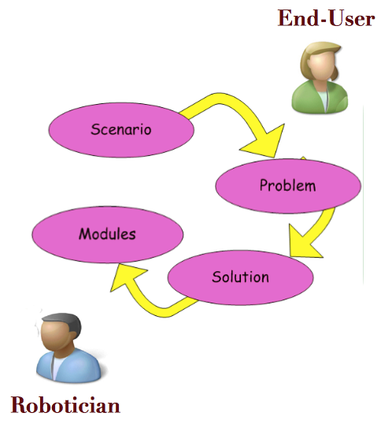
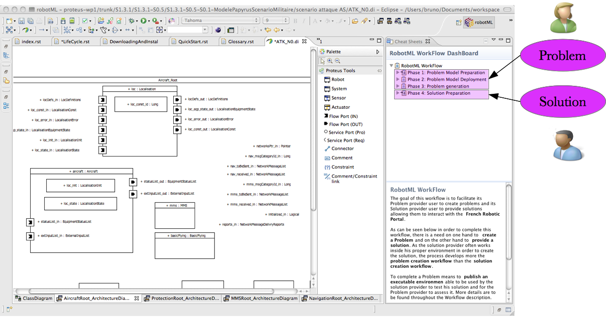

.. _ITR_LC:

Life cycle
----------

In order to understand the life cycle, it is necessary to introduce some definitions that explicit its different actors and what they are manipulating. 

Roles
^^^^^

The different actors of the *lifecycle* are many. Nevertheless the roles they can adopt are not so.
Figure :ref:`ITR_I_F1` introduces the two roles to be considered:

	#. :term:`Provider <provider>`\ : Here it means one actor that is producing objects to be provided to actors adpoting the second role;
	#. :term:`User <user>`\ : Here it means one actor that is using what was provided by th eprevious actor eventually (two roles in one actor) to produce
      and provide other objects.
      

Objects on the :term:`portal`
^^^^^^^^^^^^^^^^^^^^^^^^^^^^^

Thus :term:`provider`\ s create and upload many different objects that can be downloaded by many :term:`user`\ s. Objects' type that could be exchanged are numerous:

	#. :term:`Model <model>`\ : It is an abstract view of a system; 
	#. :term:`Algorithm <algorithm>`\ : an Algorithm :term:`provider` can provide to the community either a description of its solution or a software module implementing 
      this description. In the scope of the :term:`portal` this module will have to respect properties.
	#. :term:`Problem <problem>`\ : in the scope of the portal a *problem* is not only some documents lightly defining problems' condition. It means to provide specific data allowing to understand in detail what it is and to assess possible answers against it.
	#. :term:`Robot <robot>`\ : This portal is open to the community and thus also to Robots providers that will be able to promote their products on the portal. In the context of the life cycle it means also that
	#. Data: It can be videos, photos, whatever that is of interest to robotic, e.g. elements to test video processing functions or EM images, etc.
	
.. TODO 
	it is necessary to reference the properties stated to exist considering algorithms as well as video and the like...

Life Cycle
^^^^^^^^^^

Presentation
____________

Rationale, Roles and objects to be manipulated are not sufficient to implement a life cycle. In fact, the `portal` philosophy is explicitly build around the following life cycle:

	1. In order to begin such a life cycle, it is necessary first to ask questions and in this scope it means for :term:`Problem <problem>` to provide :term:`problem`\ s
	2. Then there is a need to provide answers, it means for :term:`Solutions <solution>` to provide :term:`Algorithms, including architectures <algorithm>` able to answer the question asked by the above :term:`problem`\ .
	3. Last but not least, there should be away for those asking questions to assess for themselves the so-called answers.
	
These steps are described in the following figure

   *PROTEUS Workflow*

As can be seen :term:`Scenario <scenario>` and :term:`Problems <problem>` are in the hands mostly of the end-users.
An end-user is often a company not knowing how to solve a question but knowing what this question is.
It is in our context up to roboticians to provide answers to these questions providing :term:`Solutions <solution>` 
and going to the extent of creating reusable :term:`modules <module>` for the community to consider at large.

Portal and life cycle
_____________________

As can be seen in the following picture, the :term:`RobotML` :term:`portal` implements as it is this life cycle taking into
account management of web account (authoring, reserved space on the portal, ...).  

.. TODO
	introduce portal image that shows the implementation of the lifecycle on the portal.

RobotML platform and life cycle
_______________________________

As can be seen on the following picture a specific customisation of the platform help system has been created that implements
the life cycle. The user will be able to follow it and she / he will be guided through the different steps implementing each 
of the steps of the life cycle.

   *RobotML platform implementation of Life cycle*
