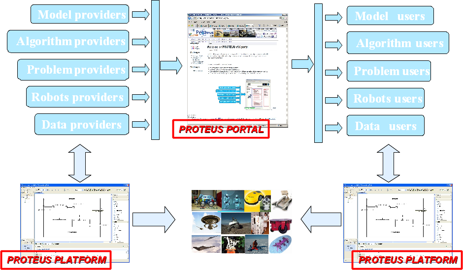

.. _ITR-I:

Introduction to RobotML
=======================

:term:`RobotMl` documentation covers many things. In order to understand the
underlying logic it is necessary to understand what is :term:`RobotML`, what
are its different parts and what part the documentation is describing.

:term:`RobotML` is composed of three main parts and some associated tools. These
three parts are:

  1. A modelling platform based upon :term:`Papyrus` that allows to represent
  Robotics systems and associated environments 
  2. Generators based upon :term:`Acceleo` and allowing to deploy the models
  composed thanks to the above parts towards a list of robotic middle-ware
  (namely as well as two environment simulator (namely :term:`MORSE` and
  :term:`Cycab-Tk`)

The rationale of RobotML  
************************

The goal of the RobotML development is to ease interactions between the different actors of the community.
This goal is based upon the idea promoted in the following schematic.

   *PROTEUS Rationale*

The sections that follow are detailing this schematic. 
The *Life Cycle* section details how the interactions are embodied in real life and 
the :term:`RobotML` explains how the different developed tools and parts instantiate this life cycle.

.. toctree::
   :maxdepth: 1

   Life cycle <LifeCycle>
   RobotML development and Life cycle <LifeCycleSupportingTools>   

.. note:: It is of more importance to read the description of the :ref:`Life cycle <QS-L>` and the following pages.

Some history
************

The :term:`RobotML` platform has been created thanks to the French :term:`ANR` :term:`PROTEUS` project. It seems polite to tell some words about it. 

.. toctree::
   :maxdepth: 1

   PROTEUS as a project <ProteusProject> 
   PROTEUS and the Robotic community <ProteusRoboticCommunity>
   After PROTEUS <AfterProteus>
