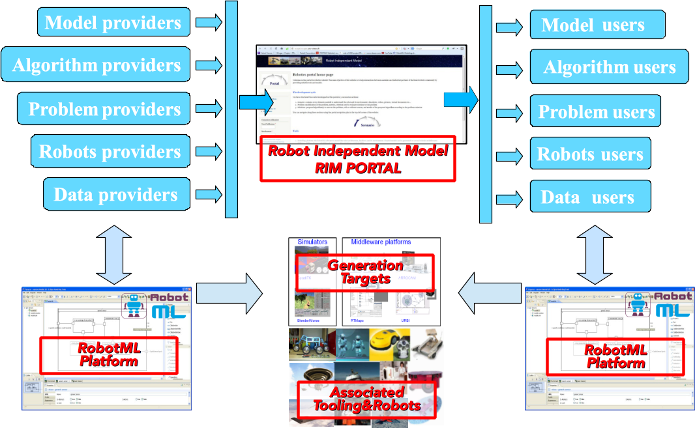

.. _ITR_I:

Introduction to :term:`RobotML`
===============================

:term:`RobotML` covers many things. In order to understand its underlying logic it is necessary to understand what
are its different parts. :term:`RobotML` is in fact composed of three main parts and some associated tools. These parts are:

1. **A modelling platform** based upon :term:`Papyrus` that allows its :term:`user` to represent Robotics systems and associated environments;
2. **Generators** based upon :term:`Acceleo` and allowing to deploy the models composed thanks to the above part towards a list of targets. If the :term:`user` can use
   the generators proposed, it up to the :term:`developer` to create the plugin providing this capability. More details are provided following :ref:`RMLCG_I`;
3. **Associated tools** that allow the :term:`user` to compile and execute the generated code thanks to the generators above. There are two types of targets:

   1. **Robotic middleware targets**: This type of targets allow the robotician to ignore the details of sensors and actuators focussing on the processing of information (such as decision taking).
   2. **Environment simulators**: this type of targets allow the robotician tp ake the robot(s) live somewhere, presents information to the sensors and exhibit the consequence of decision taken onto the "real" world.

4. **A Community portal** called :term:`RIM` portal (RIM means **R**\ obot **I**\ ndependant **M**\ odel) where the Robotic community can share models and the like allowing the interactions to occur.

.. _ITR_I_TRML:

Interactions between :term:`RobotML` parts
******************************************

The different parts presented above are interacting one with another in order to answer the needs as already presented (see :ref:`I_RMLD`).
These interactions have to be understood in order to apprehend the :term:`RobotML` environment as a whole.
The following figure presents the parts and their possible interactions.
 

.. _ITR_I_F1:

   
   **PROTEUS Rationale**

The sections that follow are detailing this schematic explaining how the interactions occur and what kind of interactions
exists. This is what we called **the Life Cycle** that is detailed below and indicates how the interactions are embodied in real life. 
the *RobotML development and Life cycle* explains how the different developed tools and parts instantiate this life cycle.

.. toctree::
   :maxdepth: 1

   Life cycle <LifeCycle>
   RobotML development and Life cycle <LifeCycleSupportingTools>   

.. note:
   It is of some importance to read the description of the :ref:`Life cycle <QS-L>` and the following pages.
   This is due to the fact that it allows the reader to understand the underlying logic of the all :term:`RobotML` approach.

.. _ITR_I_RMLQ:

RobotML Quickstart
******************

The best way to start working with :term:`RobotML` is to first install it from one of its binary (go to http://rim.bourges.univ-orleans.fr)
and then go directly to the expanded tutorial (see section :ref:`UG_T).

.. _ITR_I_ORML:

Origin of RobotML
*****************

The :term:`RobotML` platform has been created thanks to the French :term:`ANR` :term:`PROTEUS` project.
It seems polite to say some words about it. 

.. toctree::
   :maxdepth: 1

   PROTEUS as a project <ProteusProject> 
   PROTEUS and the Robotic community <ProteusRoboticCommunity>
