.. PB_Model_Create :

================================================================
Your First Scenario - attack an airport - Problem model creation
================================================================

Now we go to create a RobotML project and model our problem.

Create a RobotML project
########################

Register our SVN reository
**************************
With the **Window** menu, open the **SVN repository exploring** perspective.
Press **Add a new SVN location** button |add_svn_location| in the **Project explorer** view.

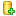

Enter the url SVN repository given by the **RobotML portal** site in the **Add SVN repository** window.

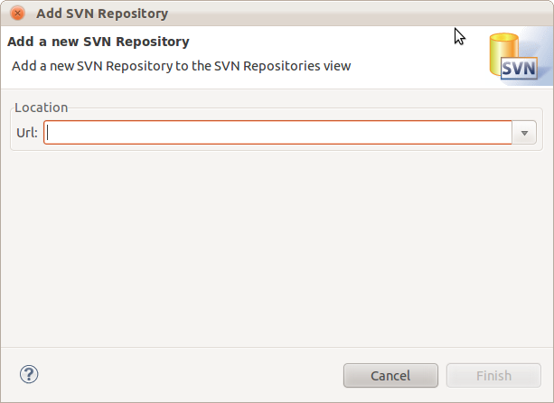
   
Enter the **RobotML portal** authentification.

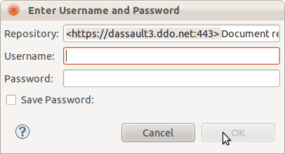
 
.. note:: Can save the authentification informations for next time.

Next clic on finish. The new SNV repository will be added in the **Project explorer** view.
 
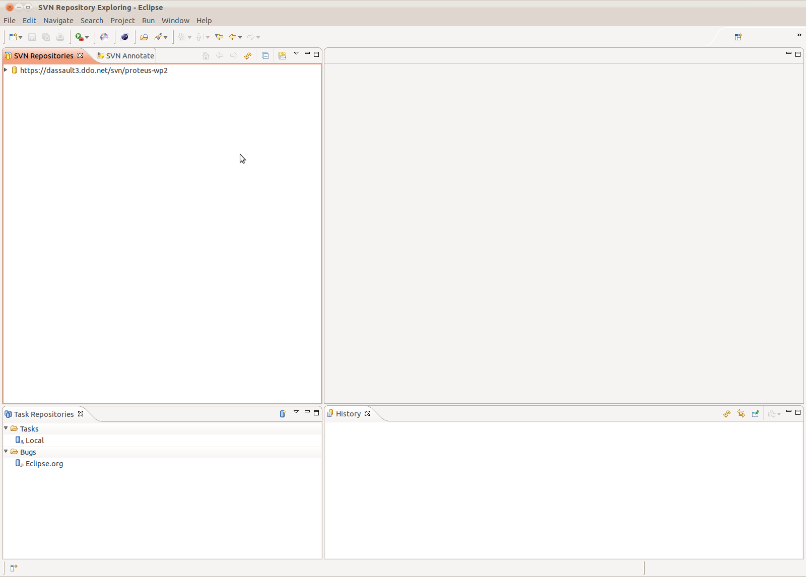
   
Checking out our SVN repository and create the RobotML project
**************************************************************

.. image:: ../ATKScenario_images/svn_checkout.png
   :align: left
   :alt: SVN Checkout command
   
In the **SVN repository exploring** perspective, go in the **SVN repositories** view. Select the new location added and open it. Select the **trunk** node, 
and do right clic to select the **Checkout** command.
Select *Check out as a project configured using new Project Wizard*.

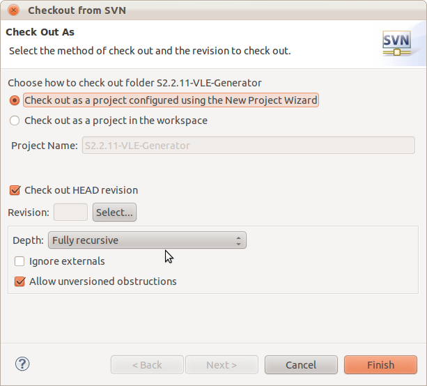
   
.. important:: Should checking out the HEAD revision.

At next, select the **RobotML project** in the **Papyrus** category.

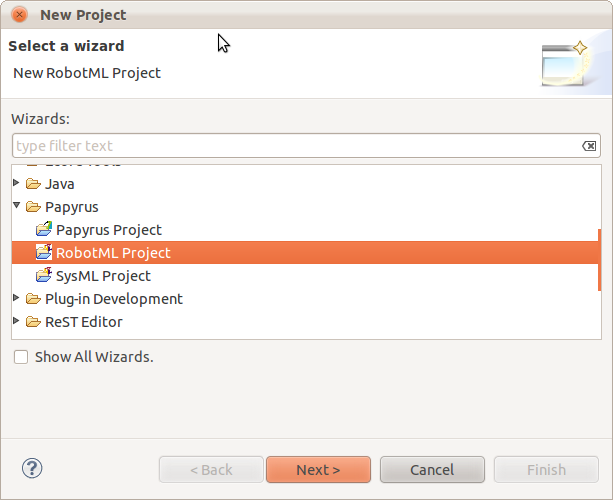

Name your RobotML project as "ATK_Scenario", and clic **Finish**.

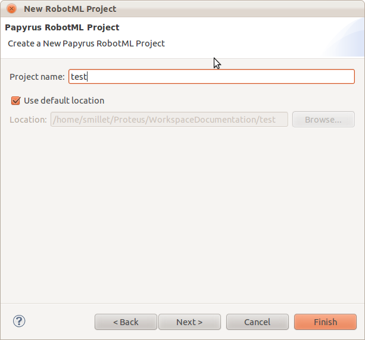
   
With the **Window** menu, select the **Java** perspective. We should to view the new **ATK_Scenario** project in the **Project explorer** view.
This projct contains the new RobotML project created.

.. image:: ../ATKScenario_images/added_project_into_wokspace.png
   :align: center
   :alt: Project added into workspace

Modeling our problem
********************

Now we have to checkout our SVN repository. We go to model our problem, but now we have a problem:

:what: How to deasign our scenario?
:how: We should to separate on any part.

We go to deasign our model on 4 parts:

+---------+------------+--------------------------------+
| Project | Model name | Model description              |
| level   |            |                                |
+=========+============+================================+
| 0       | ATK_N0     | Contain required model object  |
|         |            | (datatype, external library).  |
+---------+------------+--------------------------------+
| 1       | ATK_N1     | Contain the basic model object |
+---------+------------+--------------------------------+
| 2       | ATK_N2     | Contain the system object      |
|         |            | model.                         |
+---------+------------+--------------------------------+
| 3       | ATK_N3     | Contain the robot object model |
+---------+------------+--------------------------------+
| 4       | ATK_N4     | Contain the scenary oject      |
|         |            | model.                         |
+---------+------------+--------------------------------+

:what: Why do this?
:how: Because if we want, **we could shared the model element with other model**, and it's **easiest to debug a small model**.

Model creation
==============

In first time we have created the model level 0. Now we go to create the other levels.

In the **Project explorer** view, select the project node and do right clic to select the *New/Other...* submenu.
Choose **RobotML Model** in the **Papyrus** category.

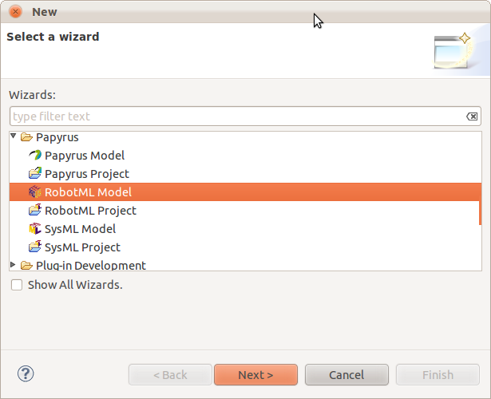
   
Next name the new model as **ATK_N1**, and clic on finish.

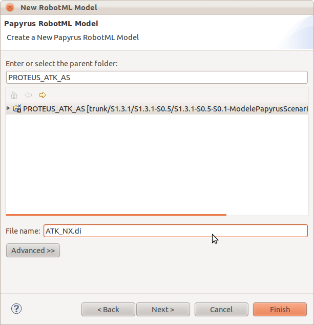

The new model is added to the workspace.

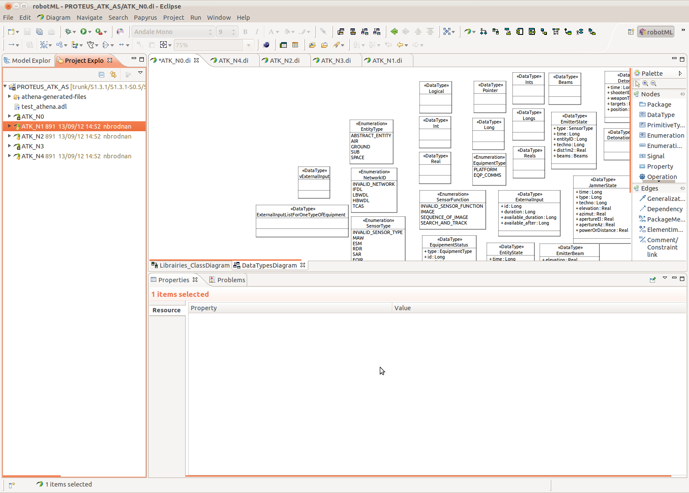

.. note:: We should repeat this operation to create the other model (ATK_N2, ATK_N3 and ATK_N4).

Adding required object in the model
-----------------------------------

In the **Project explorer** view, open the **ATK_N0** RobotML model, and with the menu **Window/Open perspective...** open the **Model explorer** view. 
Select the root node model and rename it as **RequiredObjectModel**.
Select root model node and do rigth clic. In the context menu, select **Add Child/new package**. Name it **DataTypes**.

.. note:: To deasign the model, it's more easy to work with diagram. Don't create element with menu if this is possible (except package and enumeration values).
 
Create model's DataType
^^^^^^^^^^^^^^^^^^^^^^^

Selet the **DataTypes** node and do right clic. In the context menu, **Add diagram/new DataType diagram**. name it **DataType_diagram**.

Now all action to add datatypes elements should to be done in this diagram. For this we should to use the **RobotML tool panel**, locate on the right side of the diagram.

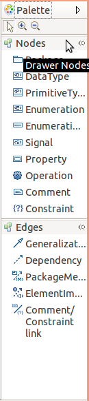

Create basic datatype
^^^^^^^^^^^^^^^^^^^^^

Select the **DataType component** in the **RobotML tool panel** and drag it on the diagram. Go it the **Properties** view, and rename the new datatype as **Long**. Add default value as **0** with a **Literal Integer**.

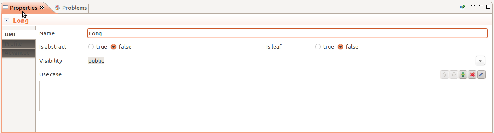

Add the following basic datatype:

* Logical
* Pointer
* Real
* Int

Create enumeration
^^^^^^^^^^^^^^^^^^

In the **RobotML tool panel**, select the **Enumeration component** and drag it on the diagram. Go on the **Property** view and name the new enumeration **EntityType**.
In th **RobotML tool panel**, select the **Enumeration literal** and drag it in the created enumeration. Select it and name it **ABSTRACT_ENTITY**.

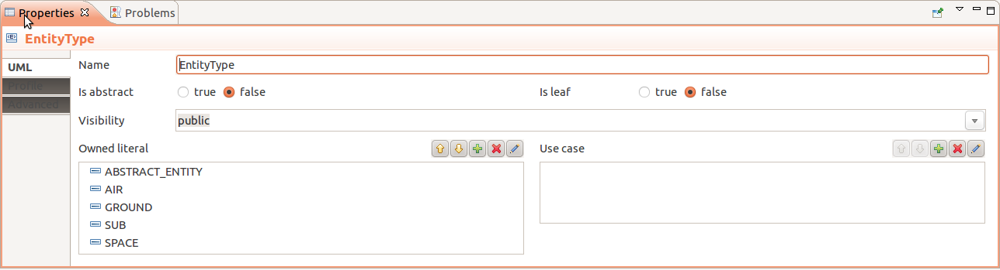

In the **Model explorer** view, select the **EntityType** node and expand it. Select the **ABSTRACT_ENTITY** node and do right clic. Select **Add child / new LiteralValue** in the context menu. Name the lietral as **ABSTRACT_ENTITY_VALUE** and put his value at **0**.

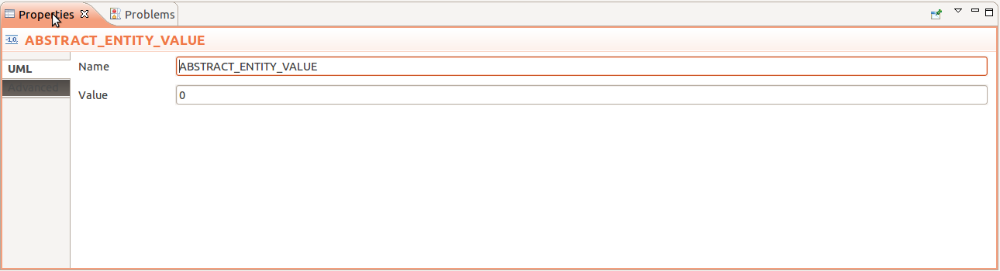

Repeat the operation to complete the **EntityType** enumeration as *AIR(0), GROUND(2), SEA(3), SUB(4), SPACE(5)*.
   
Create the enumeration referenced in the :ref:`Annex <Annex>`.

Create composed datatype
^^^^^^^^^^^^^^^^^^^^^^^^

In the **RobotML tool panel**, select the **DatatType component** and drag it on the diagram. Go it the **Properties** view, and rename the new datatype as **SensorTechno**.
In the **RobotML tool panel**, selcet the **Attribute component** and drag it in the new datatype created. Select the new attribute and edit their properties in the **Property** view.
Name it as **id**, and select **Long** for the type value. Add a another attribute to the datatype. his name is **range** and is type is **Real**.

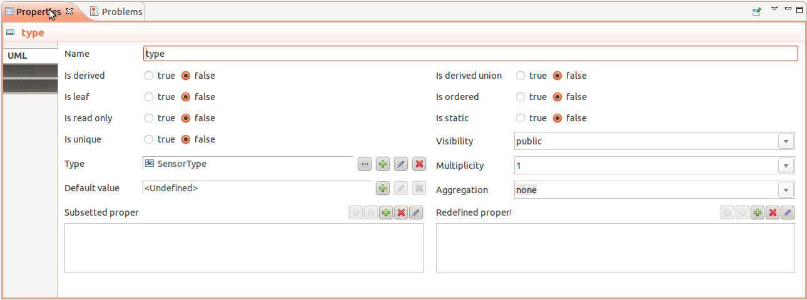
   
Create the composed datatypes referenced int the :ref:`Annex <Annex>`.

Create our external librairy
^^^^^^^^^^^^^^^^^^^^^^^^^^^^

In the **Model explorer** view, select the root model node. Do right clic and select **Add child / new package...** to add the **Librairies** package.
Select the **Librairies** package and do right clic and add a new component diagram selection **Add diagram / new RobotML component diagram...** in the context menu.
Name the diagram as **ExternalLibrairies_ComponentDiagram**.
In the new Diagram select **Component** element in the **RobotML tool panel** and drag it on the diagram. Name the component as **libExternalFunction**.  
In the **Property** view, select **Profil** and assign the **AlgorithmLibrary** profil.

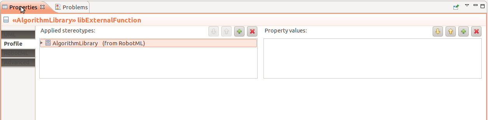

Create our external librairy's functions
^^^^^^^^^^^^^^^^^^^^^^^^^^^^^^^^^^^^^^^^

In our scenario we have two kinds of function:

* A simple interaction
* A processing

*A simple interaction*

In the **ExternalLibrairies_ComponentDiagram** view, select the **Operation** element in the **RobotML tool panel** and drag it on the **libExternalFunction** component. A new operation has added in the external librairy component, select it and rename as **manageSASystem**.
Go on the profil tab and assign the **Algorithm** profil.

Edit the properties and add the function parameters on clicking on |add_parameter| button *(See the* :ref:`Annex <Annex>` *to know the parameters)*.

Create the external function referenced in the :ref:`Annex <Annex>`.

*A processing*

 
