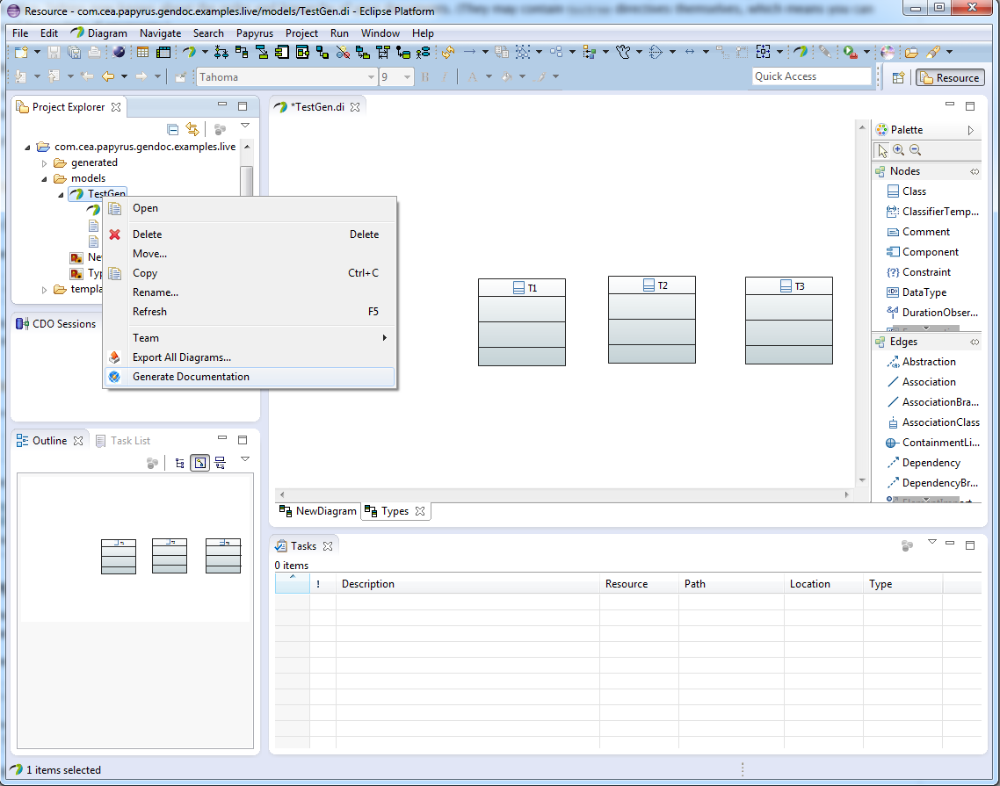

Generating documentation
========================

1. Start the RobotML tool
2. Right click on the model root in the Project explorer

   
3. Click on Generate Documentation

.. figure:: images/RobotMLGendoc2.png
   :align: center
   :alt: generator view
   
4. Choose the language of your model (default is RobotML)
5. Choose the output path (default is your model path)
6. Choose the name of the generated file (default is the name of your model)
7. Click on finish